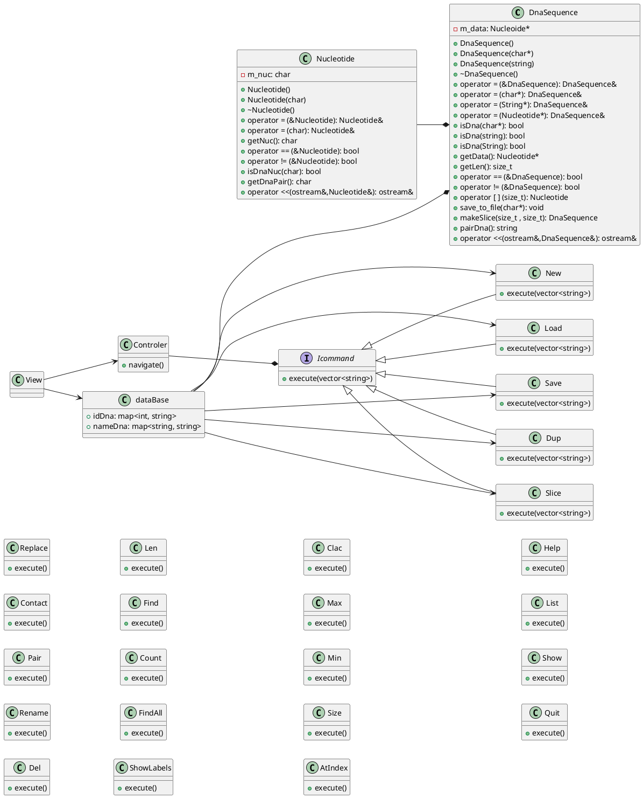
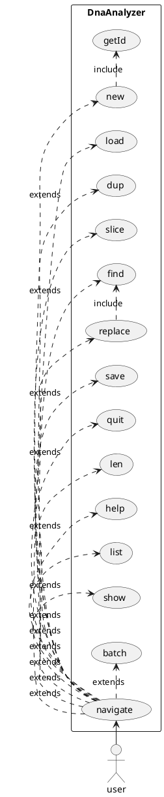
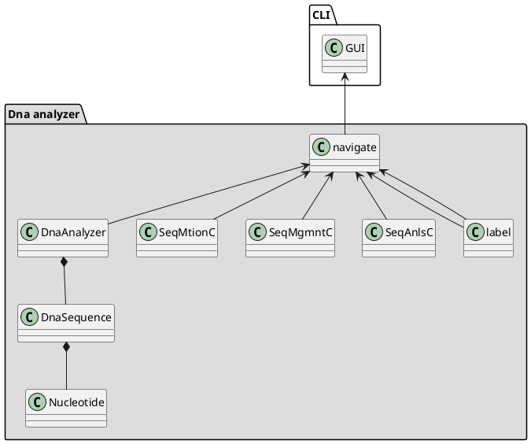

#DNA analyzer UML

##class diagram

```plantuml


@startuml
left to right direction
class DnaSequence
{
    - m_data: Nucleoide*
    + DnaSequence()
    + DnaSequence(char*)
    + DnaSequence(string)
    + ~DnaSequence()
    + operator = (&DnaSequence): DnaSequence&
    + operator = (char*): DnaSequence&
    + operator = (String*): DnaSequence&
    + operator = (Nucleotide*): DnaSequence&
    + isDna(char*): bool
    + isDna(string): bool
    + isDna(String): bool
    + getData(): Nucleotide*
    + getLen(): size_t
    + operator == (&DnaSequence): bool
    + operator != (&DnaSequence): bool
    + operator [ ] (size_t): Nucleotide
    + save_to_file(char*): void
    + makeSlice(size_t , size_t): DnaSequence
    + pairDna(): string
    + operator <<(ostream&,DnaSequence&): ostream&
}

class Nucleotide
{
    - m_nuc: char
    + Nucleotide()
    + Nucleotide(char)
    + ~Nucleotide()
    + operator = (&Nucleotide): Nucleotide&
    + operator = (char): Nucleotide&
    + getNuc(): char
    + operator == (&Nucleotide): bool
    + operator != (&Nucleotide): bool
    + isDnaNuc(char): bool
    + getDnaPair(): char
    + operator <<(ostream&,Nucleotide&): ostream&
}

class Controler
{
    +navigate()
}

interface Icommand{
    +execute(vector<string>)
}

class New{
    +execute(vector<string>)
}

class Load{
    +execute(vector<string>)
}

class Save{
    +execute(vector<string>)
}

class Dup{
    +execute(vector<string>)
}

class Slice{
    +execute(vector<string>)
}

class Replace{
    +execute()
}

class Contact{
    +execute()
}

class Pair{
    +execute()
}

class Rename{
    +execute()
}

class Del{
    +execute()
}


class Len{
    +execute()
}

class Find{
    +execute()
}

class Count{
    +execute()
}

class FindAll{
    +execute()
}


class ShowLabels{
    +execute()
}

class Clac{
    +execute()
}

class Max{
    +execute()
}

class Min{
    +execute()
}

class Size{
    +execute()
}

class AtIndex{
    +execute()
}


class Help{
    +execute()
}

class List{
    +execute()
}

class Show{
    +execute()
}

class Quit{
    +execute()
}

Icommand <|-- New
Icommand <|-- Load
Icommand <|-- Dup
Icommand <|-- Save
Icommand <|-- Slice


class dataBase
{
    +idDna: map<int, string> 
    +nameDna: map<string, string> 
}

Nucleotide --* DnaSequence

Controler --* Icommand

View --> dataBase
View --> Controler
dataBase ---* DnaSequence

dataBase ---> New
dataBase ---> Load
dataBase ---> Dup
dataBase ---> Save
dataBase ---> Slice


@enduml

```

##use case diagram

```plantuml
@startuml

left to right direction
skinparam packageStyle rectangle
actor user

rectangle DnaAnalyzer {
user -> (navigate)
(navigate) .> (new): extends
(new) .> (getId): include
(navigate) .> (load): extends
(navigate) .> (dup): extends
(navigate) .> (slice): extends
(navigate) .> (replace): extends
(replace) .> (find): include
(navigate) .> (save): extends
(navigate) .> (quit) : extends
(navigate) .> (len) : extends
(navigate) .> (find) : extends
(navigate) .> (help) : extends
(navigate) .> (list) : extends
(navigate) .> (show) : extends
(navigate) .> (batch) : extends


}

@enduml
```

##package diagram

```plantuml
@startuml

package "Dna analyzer" #DDDDDD {
    DnaAnalyzer *-- DnaSequence
    DnaSequence *-- Nucleotide
    navigate <-- DnaAnalyzer
    navigate <-- SeqMtionC
    navigate <-- SeqMgmntC
    navigate <-- SeqAnlsC
    navigate <-- label
    navigate <-- label
}
package CLI {
    GUI <-- navigate
}
@enduml
```